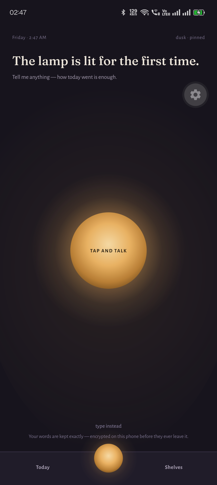
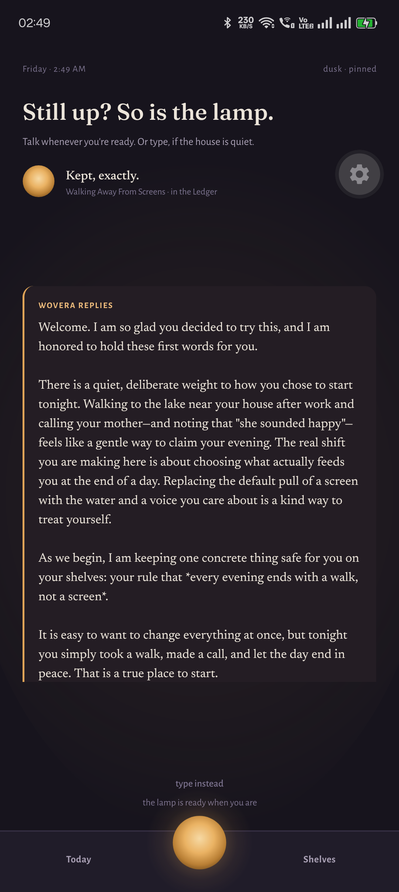
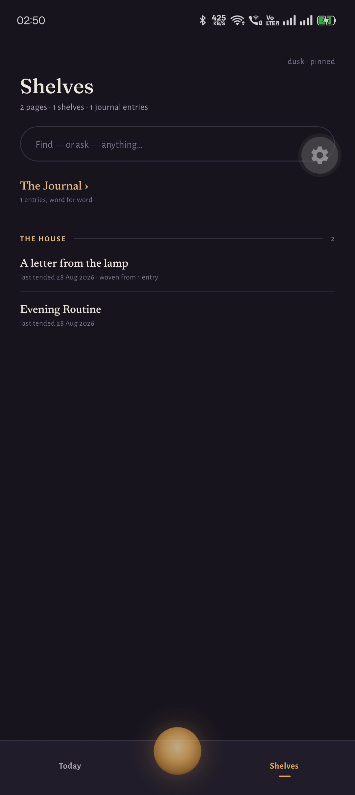
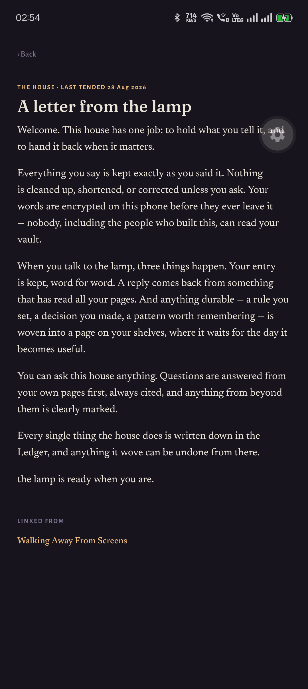

<div align="center">

# Wovera

**A second brain that hands things back.**

[](https://github.com/imSuvro/wovera/actions/workflows/ci.yml)
[](LICENSE)
[](#roadmap)

_Put anything down — a thought, a person you met, a lecture you're studying, a thing to do later —_
_and it returns to you at the moment it matters, with a full record of everything done on your behalf._

</div>

---

Most apps in this genre are excellent at **saving** things. Notes pile up, tagged and filed, and are never seen again — the graveyard problem every note-taker knows. Wovera is built around the opposite motion: **the return trip**. The home screen isn't a blank page or a feed of what you saved; it's what your vault is handing back to you today.

Underneath is a voice-first journal with an AI that has genuinely read your story — grounded in your own pages, citing them back to you — plus a self-organizing wiki, a people shelf, gentle reminders, and study sessions over anything you paste in.

Wovera grew out of a real markdown vault its maker lived in daily for months — journal, wiki, people, and an append-only log, tended by an AI. The app is that system's second life, rebuilt so anyone can live in it.

## What it looks like

<div align="center">

| The first evening                                                                               | The reply                                                                                         |
| ----------------------------------------------------------------------------------------------- | ------------------------------------------------------------------------------------------------- |
|  |  |
| The lamp is lit before anything else — capture is the whole onboarding.                         | Your entry is kept, then a reply arrives on the Letter: warm, grounded, citing your own pages.    |

| Your shelves                                                                                          | The reading room                                                                     |
| ----------------------------------------------------------------------------------------------------- | ------------------------------------------------------------------------------------ |
|           |  |
| Pages grow from what you tell the lamp, each shelf a bookplate, each page showing where it came from. | Anything you ever saved is set like a book — no raw markdown ever reaches your eye.  |

<sub>Real screens from a fresh vault on an Android device. No demo data: the only page a new vault carries is the house's own welcome letter.</sub>

</div>

## The promises

These are architecture, not policy — the code is public so you can check them:

- **Your words are never rewritten.** Dictation is kept verbatim, raw audio preserved. The AI compiles _around_ your words, never over them.
- **Your journal is never used to train any AI, never read, never sold.** Speech recognition runs on-device. Cloud AI calls run only under contractual no-training terms, only with what the moment needs, storing nothing.
- **Everything the AI does is visible and reversible.** Every write lands in an append-only Ledger — tap any line, see the exact change, undo it. Consumer apps don't do this; banks do.
- **No guilt mechanics.** No streak-shaming, no red badges, no "come back tomorrow" caps mid-entry. It pings you only about things you explicitly asked it to hold.
- **It never feels slow.** Local-first: the vault lives on your device, so opening, browsing, and searching work instantly, offline, always. Sync happens quietly behind you.
- **You can leave, whole, any day.** Plain, exportable data. Comfort includes knowing the door is open.

## How it's built

One TypeScript codebase → Android, iOS, and web (Expo SDK 57). Local SQLite vault with full-text search; on-device speech recognition; an owned oplog sync protocol with end-to-end encryption (server sees ciphertext only); AI on Gemini under paid-tier no-training terms, with on-device embeddings planned for search. The full reasoning lives in [ADR 0001 — The five pillars](docs/adr/0001-the-five-pillars.md).

| Path                                     | What lives there                                        |
| ---------------------------------------- | ------------------------------------------------------- |
| [`apps/mobile`](apps/mobile)             | The Expo app — Android, iOS, and web from one source    |
| [`packages/core`](packages/core)         | Vault domain: documents, links, Ledger, oplog — pure TS |
| [`packages/importer`](packages/importer) | Imports an existing Obsidian-style markdown vault       |
| [`docs`](docs)                           | Architecture decision records & design notes            |

## Roadmap

The experience ships in chapters — the design was written as a story before any code, and every screen is drawn as an annotated plate before it is built.

**Built and running on device:**

- [x] **The Lamp** — voice capture: talk, and your words are kept exactly, in three acts (arrival, listening, kept)
- [x] **The reply** — an AI response grounded in your own vault, with citations, arriving on the Letter
- [x] **The morning after** — Today as a composed note: continuity, threads with clocks, a daily line
- [x] **Remember anything** — quick capture that files itself, visibly, into reminders, people, or threads
- [x] **The Shelves** — your knowledge, browsable, with provenance on every page
- [x] **Find, or ask, anything** — one field: instant search, and questions answered from your own pages
- [x] **The reading room** — any text you ever kept, set like a book
- [x] **The Ledger** — the audit trail a normal person can read, with one-tap undo
- [x] **House Rules** — the skeleton locked, tone and light yours
- [x] **The first evening** — a new vault that already feels lived-in, without a single fake page

**Next:**

- [ ] Sync across devices, end-to-end encrypted _(client complete and unit-proven; the account gate switches on next)_
- [ ] Studying with your shelves — paste a transcript, talk it through
- [ ] Semantic recall with on-device embeddings
- [ ] Android release → web → iOS

Known limits today: the web build runs the full interface but falls back to an in-memory vault when the browser's OPFS-backed SQLite is unavailable, so web persistence is not yet guaranteed; iOS is unbuilt.

## Developing

```bash
corepack enable   # Node >= 22
pnpm install
pnpm verify       # lint + typecheck + tests — the gate CI runs
```

Run the app:

```bash
cd apps/mobile
npx expo start --dev-client   # Android/iOS dev build
npx expo export -p web        # web bundle → apps/mobile/dist
```

The web bundle must be served with `Cross-Origin-Opener-Policy: same-origin` and
`Cross-Origin-Embedder-Policy: require-corp` (see `apps/mobile/public/serve.json`) —
without cross-origin isolation the browser cannot open the SQLite vault.

See [CONTRIBUTING.md](CONTRIBUTING.md) for the workflow and the comfort contract every change is measured against.

## License

[AGPL-3.0](LICENSE) — free to use, study, and improve; anyone who ships a modified version, including as a service, must share their changes back. The privacy claims above stay verifiable for everyone, in every fork.
